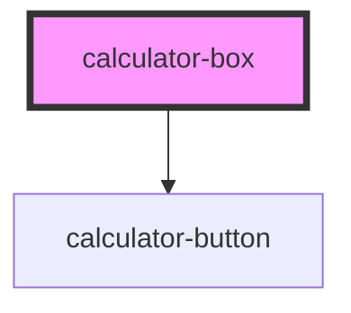

# calculator-box

<!-- Auto Generated Below -->

## Dependencies

### Depends on

- [calculator-button](./calculator-components/calculator-componets-buttons)

### Graph

----------------------------------------------

*Built with [StencilJS](https://stenciljs.com/)*
